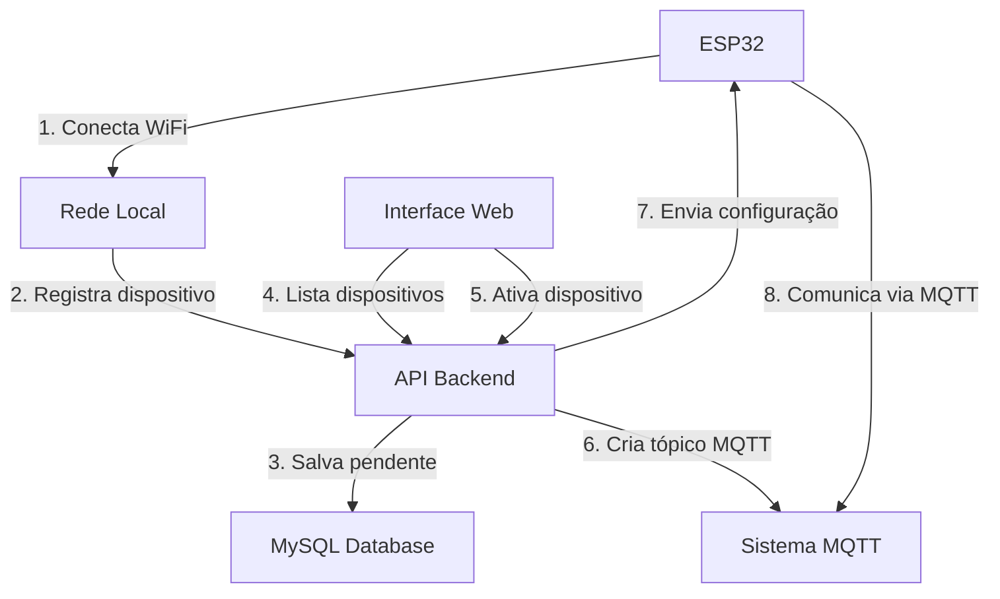

# 🚀 Sistema IoT Completo - Documentação Final

## 📌 Visão Geral

Sistema completo de gerenciamento de dispositivos IoT desenvolvido com **Laravel + ESP32 + MQTT**, permitindo registro automático, ativação e monitoramento de dispositivos em tempo real.

## 🏗️ Arquitetura do Sistema

### 📦 Repositórios GitHub

| Repositório | Descrição | URL |
|-------------|-----------|-----|
| **mqtt** | 🔧 API Backend Principal | https://github.com/CelDarley/mqtt.git |
| **iot-config-app-laravel** | 📱 Interface de Gerenciamento | https://github.com/CelDarley/iot-config-app-laravel.git |
| **iot-config-web-laravel** | 🌐 Interface Web | https://github.com/CelDarley/iot-config-web-laravel.git |

### 🔄 Fluxo de Funcionamento



## 🔧 Componentes Implementados

### 1. **API Backend** (`mqtt/`)
- ✅ **PendingDeviceController**: CRUD completo de dispositivos
- ✅ **PendingDevice Model**: Timestamps em milissegundos
- ✅ **Ativação automática**: Cria tópicos MQTT
- ✅ **MySQL integrado**: Configuração corrigida
- ✅ **Endpoints públicos**: Para ESP32 e interface web
- ✅ **Validação e logs**: Sistema robusto de debugging

### 2. **Interface de Gerenciamento** (`iot-config-app-laravel/`)
- ✅ **Lista de dispositivos**: Visualização em tempo real
- ✅ **Formulário de ativação**: Departamento + tipo de dispositivo
- ✅ **Operações CRUD**: Ativar, rejeitar, excluir
- ✅ **AJAX funcional**: Sem recarregamento de página
- ✅ **Feedback visual**: Alertas e confirmações
- ✅ **Design responsivo**: Bootstrap 5

### 3. **Firmware ESP32** (`esp32_wifi_mqtt_manager_CORRIGIDO/`)
- ✅ **Modo AP**: Configuração via web (192.168.4.1:5000)
- ✅ **Auto-registro**: Envio automático para API
- ✅ **LEDs de status**: Indicação visual completa
- ✅ **Tratamento HTTP**: Códigos de resposta corretos
- ✅ **Conexão MQTT**: Configuração automática
- ✅ **Persistência**: Credenciais salvas na EEPROM

## 🚦 Sistema de LEDs ESP32

### LED de Status (Pinos 48 + 16)
- **DESLIGADO**: Dispositivo iniciando
- **PISCAR RÁPIDO**: Modo AP ativo ou erro de conexão
- **PISCAR LENTO**: Tentando conectar ao WiFi
- **LIGADO FIXO**: Conectado ao WiFi com sucesso

### LED MQTT (Pino 19)
- **3 PISCADAS LENTAS**: Dispositivo registrado com sucesso (novo)
- **2 PISCADAS LENTAS**: Dispositivo já registrado e ativado
- **1 PISCADA LONGA**: Dispositivo registrado mas aguardando ativação
- **5 PISCADAS RÁPIDAS**: Erro HTTP no registro
- **10 PISCADAS MUITO RÁPIDAS**: Erro de conexão de rede

## 🌐 Endpoints da API

### Dispositivos Pendentes (Públicos)
```http
GET    /api/devices/pending           # Listar dispositivos
POST   /api/devices/pending           # Registrar novo (ESP32)
GET    /api/devices/pending/{id}      # Detalhes do dispositivo
POST   /api/devices/pending/{id}/activate  # Ativar dispositivo
POST   /api/devices/pending/{id}/reject    # Rejeitar dispositivo
DELETE /api/devices/pending/{id}      # Excluir dispositivo
```

### Tópicos MQTT
```http
GET    /api/mqtt/topics              # Listar tópicos criados
```

## 🗄️ Estrutura do Banco de Dados

### Tabela: `pending_devices`
```sql
- id (bigint, PK)
- mac_address (string, unique)
- device_name (string)
- ip_address (string, nullable)
- wifi_ssid (string, nullable)
- status (enum: pending, activated, rejected)
- registered_at (bigint, timestamp em milissegundos)
- activated_at (datetime, nullable)
- activated_by (bigint, FK users)
- device_info (json, nullable)
```

### Tabela: `topics`
```sql
- id (bigint, PK)
- name (string, unique)
- device_mac (string)
- department (string)
- device_type (string)
- created_at (datetime)
```

## 🔄 Processo de Ativação

1. **ESP32** se conecta ao WiFi e registra na API
2. **Dispositivo** aparece como "pendente" na interface web
3. **Administrador** acessa http://localhost:8001
4. **Clica no botão ▶️** para ativar o dispositivo
5. **Preenche formulário**:
   - Tipo: sensor, atuador, controlador, monitor
   - Departamento: nome do setor
6. **Sistema automaticamente**:
   - Cria tópico MQTT: `iot/{departamento}/{tipo}/{mac_sem_dois_pontos}`
   - Atualiza status para "ativado"
   - Envia configuração MQTT para o ESP32
7. **ESP32** recebe configuração e inicia comunicação MQTT

## 🚀 Como Executar

### 1. API Backend
```bash
cd mqtt/
php artisan serve --host=0.0.0.0 --port=8000
```

### 2. Interface de Gerenciamento
```bash
cd iot-config-app-laravel/
php artisan serve --host=0.0.0.0 --port=8001
```

### 3. Interface Web (opcional)
```bash
cd iot-config-web-laravel/
php artisan serve --host=0.0.0.0 --port=8002
```

### 4. ESP32
- Carregar firmware `esp32_wifi_mqtt_manager_CORRIGIDO.ino`
- Acessar modo AP: http://192.168.4.1:5000
- Configurar WiFi e nome do dispositivo

## 📊 Monitoramento

- **Interface Web**: http://localhost:8001
- **API Status**: http://localhost:8000/api/devices/pending
- **Logs Laravel**: `tail -f storage/logs/laravel.log`
- **Serial Monitor**: 115200 baud para logs do ESP32

## 🎯 Funcionalidades Implementadas

- ✅ **Registro automático** de dispositivos ESP32
- ✅ **Interface de gerenciamento** web completa
- ✅ **Sistema de ativação** com formulário
- ✅ **Criação automática** de tópicos MQTT
- ✅ **LEDs de feedback** visual no ESP32
- ✅ **Operações CRUD** completas (ativar/rejeitar/excluir)
- ✅ **Integração MySQL** configurada
- ✅ **Tratamento de erros** robusto
- ✅ **Logs detalhados** para debugging
- ✅ **Design responsivo** para mobile/desktop
- ✅ **AJAX funcional** sem recarregamento

## 🔧 Configurações de Rede

### Servidor Laravel
- IP: 10.102.0.112
- Portas: 8000 (API), 8001 (Interface), 8002 (Web)

### ESP32
- Modo AP: 192.168.4.1:5000
- Modo STA: IP dinâmico da rede WiFi

### MySQL
```env
DB_CONNECTION=mysql
DB_HOST=127.0.0.1
DB_PORT=3306
DB_DATABASE=mqtt
DB_USERNAME=roboflex
DB_PASSWORD=Roboflex()123
```

## 📈 Estatísticas do Projeto

- **3 repositórios** GitHub separados
- **1500+ linhas** de código backend
- **2000+ linhas** de código frontend
- **500+ linhas** de firmware ESP32
- **Documentação completa** com guias visuais

---

## 🎉 Sistema Funcionando Completamente!

**Status**: ✅ **PRODUÇÃO READY**

Todos os componentes estão funcionando em harmonia, desde o registro automático até a comunicação MQTT. O sistema está pronto para uso em ambiente de produção! 🚀 